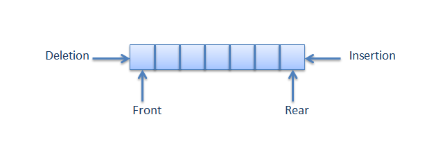
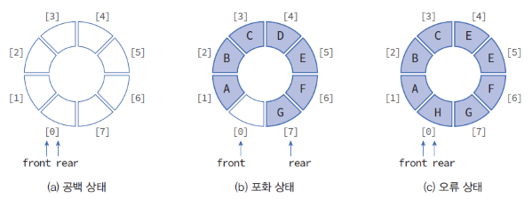

# 📚 Queue(큐)
데이터를 일시적으로 쌓아 둔 형태의 자료 구조   
**FIFO** 즉, 먼저 들어온 것이 먼저 나감 (== LILO)  
은행 번호표 뽑은 순서대로 빠져나가는 것 생각! 

 

배열을 이용하여 큐를 만들수 있지만,   
데이터를 꺼내면 그 다음 **데이터들을 위치이동**시키는 처리를 해야 함    
데이터를 꺼낼 때마다 이러한 처리를 하게되면 효율이 떨어짐

 

- enqueue : 큐에 데이터를 넣는 작업 (rear += 1)
- dequeue : 큐에서 데이터를 꺼내는 작업 (front += 1)
- front : 데이터를 꺼내는 쪽 (출구)   
- rear : 데이터를 넣는 쪽 (입구)   
- peek : front에 위치한 데이터를 읽음, 다음에 꺼낼 데이터 확인
- createQueue : 큐 생성, front와 rear는 초기에 인덱스 -1

 

## ✔ 종류
- 선형 큐   

    

    - isFull : 큐가 꽉 찼는지 확인, rear가 마지막 인덱스를 가리키면 꽉 찬 것 (rear == n - 1)
    - isEmpty : 큐가 비었는지 확인, front == rear이면 큐가 비었다고 판단   
    - 단점: 삽입 및 삭제를 반복하다 보면 rear가 맨 마지막 인덱스를 가리키고, 앞에는 비어 있을 수 있지만 이를 꽉 찼다고 인식

- 원형 큐

    - 선형 큐의 단점을 보완하기 위한 아이디어   

  
## ✔ 참고
[\[알고리즘\] 큐(Queue)](https://velog.io/@msriver/%EC%95%8C%EA%B3%A0%EB%A6%AC%EC%A6%98-%ED%81%90Queue)   
[\[알고리즘\] 2.2.자료구조 : 큐(Queue) 이해하기](https://monsieursongsong.tistory.com/5)   
[알고리즘 - 큐(Queue) : 선형 큐와 원형 큐](https://chanhuiseok.github.io/posts/algo-26/)